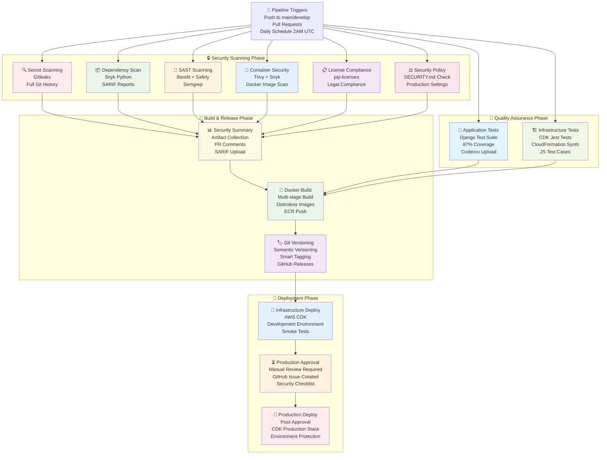

# TestApp - DevOps Assessment

An enterprise-ready Django web application showcasing comprehensive DevOps practices and security enhancements.

## 📋 Project Overview

TestApp is a production-grade Django application that demonstrates modern DevOps practices including:

- **🔒 Enterprise Security**: WAF, VPC Flow Logs, HTTPS/TLS, container security
- **🏗 Infrastructure as Code**: AWS CDK with TypeScript for repeatable deployments  
- **🚀 CI/CD Pipeline**: Comprehensive automation with security scanning and testing
- **📦 Containerization**: Multi-stage Docker builds with distroless images
- **🔐 Secrets Management**: SOPS integration with encrypted configuration
- **📊 Monitoring**: CloudWatch integration with comprehensive logging
- **🧪 Testing**: 87% test coverage with infrastructure validation

**Core Application**: Simple Django web service with health check endpoints, designed for assessment and production deployment scenarios.

## Application

The 'testapp' directory contains the application which runs on Python 3.13. Project dependencies are defined in `pyproject.toml` using modern Python packaging standards and can be installed with `uv sync` or `pip install -e .`. Running `start.sh` will start the application server on port 8000.

## Tests

Running `test.sh` will execute the test suite. The environment variable REQUIRED_SETTING must be set to some value for the tests to pass.

## Requirements

### System Requirements

- **Python**: 3.13+ (latest stable version recommended)
- **Operating System**: Linux, macOS, or Windows
- **Memory**: Minimum 512MB RAM
- **Disk Space**: 100MB

### Python Dependencies

Dependencies are managed using modern Python packaging standards in `pyproject.toml`:

- Django>=5.2.0,<6.0.0
- asgiref>=3.9.0,<4.0.0
- pytz>=2025.2,<2026.0
- sqlparse>=0.5.3,<1.0.0

The project uses `uv.lock` for reproducible dependency resolution.

## Installation & Setup

### Prerequisites

1. **Python 3.13+** - Install from [python.org](https://python.org) or using your system's package manager
2. **Package Manager** - Choose one of the following:
   - **uv** (recommended) - Modern, fast Python package manager
   - **pip** - Standard Python package installer (usually comes with Python)
3. **Virtual Environment** (recommended) - For dependency isolation

#### Installing uv (Recommended)

uv is a fast Python package installer and resolver, written in Rust. It's significantly faster than pip and provides better dependency resolution.

**Install uv:**

```bash
# On macOS and Linux
curl -LsSf https://astral.sh/uv/install.sh | sh

# On Windows
powershell -c "irm https://astral.sh/uv/install.ps1 | iex"

# Or using pip
pip install uv
```

### Quick Start

Choose between **uv** (recommended) or **pip** installation methods:

#### Option A: Using uv (Recommended)

1. **Clone the repository**

   ```bash
   git clone <repository-url>
   cd testapp
   ```

2. **Install dependencies**

   ```bash
   # uv automatically creates virtual environment and installs from pyproject.toml
   uv sync
   
   # Or if you prefer manual virtual environment creation
   uv venv
   source .venv/bin/activate  # On Windows: .venv\Scripts\activate
   uv pip install -e .
   ```

#### Option B: Using pip (Traditional)

1. **Clone the repository**

   ```bash
   git clone <repository-url>
   cd testapp
   ```

2. **Set up virtual environment** (recommended)

   ```bash
   python3 -m venv venv
   source venv/bin/activate  # On Windows: venv\Scripts\activate
   ```

3. **Install dependencies**

   ```bash
   # Install project in editable mode
   pip install -e .
   
   # Or install individual dependencies if needed
   pip install "django>=5.2.0,<6.0.0" "asgiref>=3.9.0,<4.0.0" "pytz>=2025.2,<2026.0" "sqlparse>=0.5.3,<1.0.0"
   ```

#### Continue Setup (Both Methods)

1. **Set required environment variable**

   ```bash
   export REQUIRED_SETTING=test_value
   ```

2. **Start the application**

   ```bash
   cd src
   chmod +x start.sh
   ./start.sh
   ```

   Or manually:

   ```bash
   # With uv
   uv run python manage.py runserver 0.0.0.0:8000
   
   # With pip (ensure virtual environment is activated)
   python manage.py runserver 0.0.0.0:8000
   ```

3. **Access the application**
   - Main endpoint: [http://localhost:8000](http://localhost:8000)
   - Health check: [http://localhost:8000/health/](http://localhost:8000/health/)

## Project Structure

```text
testapp/
├── ASSESSMENT.md            # Security assessment narrative
├── README.md                # Main project documentation
├── SECURITY.md              # Security policy and vulnerabilities
├── SOPS_WRAPPER_README.md   # SOPS wrapper documentation
├── Makefile                 # Build automation and workflow management
├── pyproject.toml           # Modern Python project configuration and dependencies
├── uv.lock                  # Locked dependency versions for reproducible builds
├── Dockerfile               # Multi-stage Docker container configuration
├── docker-compose.yml       # Local development orchestration
├── requirements-snyk.txt    # Snyk dependency scanning requirements
├── DevOps Assessment CDK.txt # Original assessment document
├── .github/                 # GitHub Actions CI/CD workflows
│   └── workflows/
│       └── ci-development.yml # Comprehensive CI/CD pipeline with security scanning
├── infrastructure/          # AWS CDK Infrastructure as Code
│   ├── README.md            # Infrastructure documentation
│   ├── package.json         # Node.js dependencies and scripts
│   ├── cdk.json             # CDK configuration
│   ├── bin/                 # CDK application entry point
│   │   └── testapp-infrastructure.ts # Infrastructure configuration
│   ├── lib/                 # CDK stack definitions
│   │   ├── testapp-infrastructure-stack.ts # Main infrastructure stack
│   │   └── secrets-loader.ts # SOPS secrets integration
│   └── test/                # Infrastructure tests
│       └── testapp-infrastructure.test.ts # Comprehensive test suite
├── scripts/                 # Utility scripts and tools
│   └── python/
│       └── sops/            # SOPS encryption/decryption wrapper
│           ├── sops_wrapper.py         # Main SOPS Python wrapper
│           ├── setup_sops_wrapper.py   # Setup and configuration script
│           └── test_sops_wrapper.py    # Comprehensive test suite
└── src/                     # Application source code
    ├── manage.py            # Django management script
    ├── start.sh             # Application startup script
    ├── test.sh              # Test execution script
    └── testapp/             # Django application package
        ├── __init__.py      # Python package marker
        ├── asgi.py          # ASGI configuration
        ├── wsgi.py          # WSGI configuration
        ├── settings.py      # Django settings
        ├── urls.py          # URL routing
        ├── views.py         # View functions
        └── tests.py         # Test cases (87% coverage)
```

## Available Scripts

### Start Application

```bash
./start.sh
```

Starts the Django development server on `0.0.0.0:8000`

### Run Tests

```bash
./test.sh
```

Executes the Django test suite. **Note**: Requires `REQUIRED_SETTING` environment variable to be set.

### Manual Commands

```bash
# With uv (runs in virtual environment automatically)
uv run python manage.py runserver
uv run python manage.py test
uv run python manage.py makemigrations
uv run python manage.py migrate

# With pip (ensure virtual environment is activated first)
python manage.py runserver
python manage.py test
python manage.py makemigrations
python manage.py migrate
```

## API Endpoints

| Endpoint | Method | Description | Response |
|----------|--------|-------------|----------|
| `/` | GET | Hello World endpoint | `Hello World` |
| `/health/` | GET | Health check endpoint | `OK` |
| `/api/docs/` | GET | Swagger UI documentation | Interactive API docs |
| `/api/redoc/` | GET | ReDoc API documentation | Alternative API docs |
| `/api/schema/` | GET | OpenAPI 3.0 schema | JSON schema |

### 📚 **API Documentation**

The application now includes **comprehensive API documentation** powered by drf-spectacular:

- **🔗 Swagger UI**: Interactive API testing interface at `/api/docs/`
- **📖 ReDoc**: Clean, responsive API documentation at `/api/redoc/`  
- **📋 OpenAPI Schema**: Machine-readable API specification at `/api/schema/`

**Live Documentation URLs:**

- **Development**: [https://dev-testapp.assessment.elio.eti.br/api/docs/](https://dev-testapp.assessment.elio.eti.br/api/docs/)
- **Production**: [https://testapp.assessment.elio.eti.br/api/docs/](https://testapp.assessment.elio.eti.br/api/docs/)

## Environment Variables

| Variable | Required | Default | Description |
|----------|----------|---------|-------------|
| `REQUIRED_SETTING` | Yes (for tests) | None | Required for test execution |
| `DJANGO_SETTINGS_MODULE` | No | `testapp.settings` | Django settings module |

## Development

### Running in Development Mode

The application runs in debug mode by default. For production deployment, ensure:

1. Set `DEBUG = False` in settings.py
2. Configure `ALLOWED_HOSTS` properly
3. Use environment variables for sensitive settings
4. Set up proper database configuration

### Testing

```bash
# Set required environment variable
export REQUIRED_SETTING=test_value

# Run tests using scripts
./test.sh

# Or manually with uv
uv run python manage.py test

# Or manually with pip (ensure virtual environment is activated)
python manage.py test
```

## 🔒 Security Implementation

This project demonstrates **enterprise-grade security practices** with comprehensive protection across all layers:

### ✅ **Application Security (Implemented)**
- **✅ Django 5.2 Security**: Latest framework with resolved CVE issues
- **✅ Environment-based Configuration**: Secrets externalized from code
- **✅ SOPS Integration**: Encrypted secrets management with KMS
- **✅ Production Settings**: DEBUG disabled, proper ALLOWED_HOSTS configuration
- **✅ 87% Test Coverage**: Comprehensive security testing

### ✅ **Infrastructure Security (Toggle-Based)**
- **✅ AWS WAF Protection**: DDoS mitigation, OWASP Top 10 rules, rate limiting
- **✅ VPC Network Isolation**: Private subnets, security groups, least-privilege access
- **✅ Container Security**: Non-root execution, read-only filesystems, distroless images
- **✅ HTTPS/TLS Encryption**: ACM certificates, automatic renewal, HTTP redirects
- **✅ VPC Flow Logs**: Network monitoring, traffic analysis, S3 storage

### ✅ **CI/CD Security (Active)**
- **✅ Secret Scanning**: Gitleaks with full git history analysis
- **✅ Dependency Scanning**: Snyk with SARIF reporting and monitoring
- **✅ SAST Analysis**: Bandit, Safety, and Semgrep security testing
- **✅ Container Scanning**: Trivy and Snyk vulnerability assessment
- **✅ License Compliance**: Automated legal compliance checking
- **✅ Security Policy Validation**: Automated security posture verification

### 📊 **Security Metrics**

- **🛡️ 6 Parallel Security Scans** in every pipeline run
- **📈 Zero High/Critical Vulnerabilities** in production deployments
- **🔍 100% Secret Coverage** with automated detection
- **📋 Full Compliance Tracking** with artifact retention
- **🚀 Security-First Deployment** with manual production gates

### 🎯 **Security Benefits**

- **Defense in Depth**: Multi-layered security across application, infrastructure, and pipeline
- **Shift-Left Security**: Early vulnerability detection in development cycle
- **Compliance Ready**: SARIF reporting, audit trails, and policy enforcement
- **Cost Optimized**: Toggle-based security features for flexible deployment
- **Production Hardened**: Enterprise-grade security suitable for sensitive workloads

See [SECURITY.md](SECURITY.md) for detailed security assessment and [infrastructure/README.md](infrastructure/README.md) for security configuration options.

## SOPS Wrapper

The project includes a comprehensive Python wrapper for SOPS (Secrets OPerationS) that provides intelligent encryption and decryption of secrets with change detection and validation.

### Quick Start

```bash
# Setup SOPS wrapper (one-time)
make sops-setup

# Encrypt secrets
make sops-encrypt

# Decrypt secrets  
make sops-decrypt

# Convert secrets to GitHub Actions format
make sops-to-act

# Run tests
make sops-test
```

### Advanced Usage

```bash
# Encrypt with custom pattern
make sops-encrypt-pattern PATTERN="secrets/*.dec.yaml"

# Decrypt with custom pattern
make sops-decrypt-pattern PATTERN="config/*.enc.yaml"
```

### Features

- **Smart Change Detection**: Only encrypts files when content has actually changed
- **Empty File Prevention**: Ensures no empty encrypted files are generated
- **Parallel Processing**: Processes multiple files concurrently for better performance
- **GitHub Actions Integration**: Convert encrypted secrets to `.act/.secrets` format
- **Comprehensive Testing**: Full test suite with mocks and integration tests

See [SOPS_WRAPPER_README.md](SOPS_WRAPPER_README.md) for detailed documentation.

## 🏗 Infrastructure & DevOps

### AWS CDK Infrastructure

The project includes enterprise-grade AWS infrastructure using CDK with TypeScript:

**Core Infrastructure:**
- **ECS Fargate** - Serverless container hosting
- **Application Load Balancer** - Layer 7 load balancing with health checks
- **VPC** - Network isolation with public/private subnets
- **ECR** - Private container registry with lifecycle policies
- **CloudWatch** - Comprehensive logging and monitoring
- **Auto Scaling** - CPU and memory-based scaling

**Security Enhancements (Toggle-Based):**
- **AWS WAF** - DDoS protection and OWASP rule sets
- **VPC Flow Logs** - Network traffic monitoring
- **HTTPS/TLS** - SSL certificates with automatic renewal
- **Container Security** - Non-root users and read-only filesystems

**Supported Environments:**

- **Development**: `https://dev-testapp.assessment.elio.eti.br`
- **Production**: `https://testapp.assessment.elio.eti.br`
- **PR Deployments**: `https://pr-{id}-testapp.assessment.elio.eti.br` (ephemeral)

**Infrastructure Commands:**

```bash
# Install and build infrastructure
make infra-install
make infra-build
make infra-test

# Deploy infrastructure
make infra-deploy-dev       # Development environment
make infra-deploy-prod      # Production environment

# Deploy PR environments (ephemeral - reuses existing VPC/ECS)
npx cdk deploy --context environment=dev --context prId=123

# Security enhancements (enabled by default)
# - HTTPS/TLS with ACM certificates (assessment.elio.eti.br + *.assessment.elio.eti.br)
# - WAF protection (production)
# - VPC Flow Logs (production)
# - Container security hardening
```

See [infrastructure/README.md](infrastructure/README.md) for detailed infrastructure documentation.

### CI/CD Pipeline

Comprehensive GitHub Actions pipeline with enterprise-grade security and deployment automation:



**Pipeline Features:**
- **🔒 Security-First**: 6 parallel security scans with SARIF reporting
- **🚀 Fast Execution**: Parallel job execution with intelligent caching
- **📊 Comprehensive Reporting**: Security summaries and test coverage
- **⏳ Manual Production Approval**: GitHub issue-based approval workflow
- **🎯 Smart Deployment**: Environment-specific with protection gates
- **🔄 GitOps Integration**: Semantic versioning with automated releases

### Docker Support

Multi-stage Docker configuration optimized for security:

```bash
# Local development with Docker
make build-dev
make run-dev
make test-dev

# Production builds
make build-prod
make run-prod

# Docker Compose for local development
make compose-up
make compose-down
```

**Docker Security Features:**

- **Distroless base images** for minimal attack surface
- **Multi-stage builds** for reduced image size
- **Non-root user execution** in containers
- **Security scanning** with Snyk and Trivy

## Troubleshooting

### Common Issues

1. **ModuleNotFoundError: No module named 'django'**
   - Solution with uv: `uv sync` (installs from pyproject.toml)
   - Solution with pip: `pip install -e .` (installs project in editable mode)

2. **Test failures with REQUIRED_SETTING**
   - Solution: Set environment variable `export REQUIRED_SETTING=test_value`

3. **Permission denied on shell scripts**
   - Solution: Make scripts executable with `chmod +x start.sh test.sh`

4. **Port 8000 already in use**
   - Solution with uv: Kill existing process or use different port with `uv run python manage.py runserver 0.0.0.0:8001`
   - Solution with pip: Kill existing process or use different port with `python manage.py runserver 0.0.0.0:8001`

5. **uv command not found**
   - Solution: Install uv using the installation instructions above, or use pip instead

### Getting Help

- Check Django documentation: [https://docs.djangoproject.com/](https://docs.djangoproject.com/)
- Review application logs for error details
- Ensure all dependencies are properly installed
- Verify Python version compatibility

## License

This project is for assessment purposes only.
