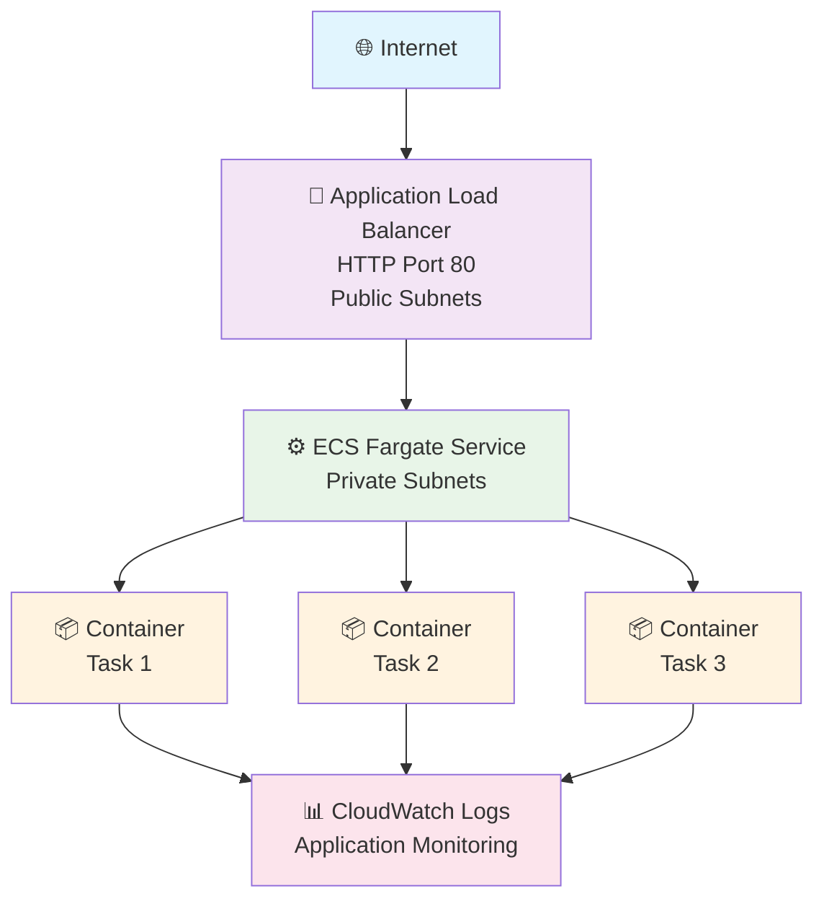
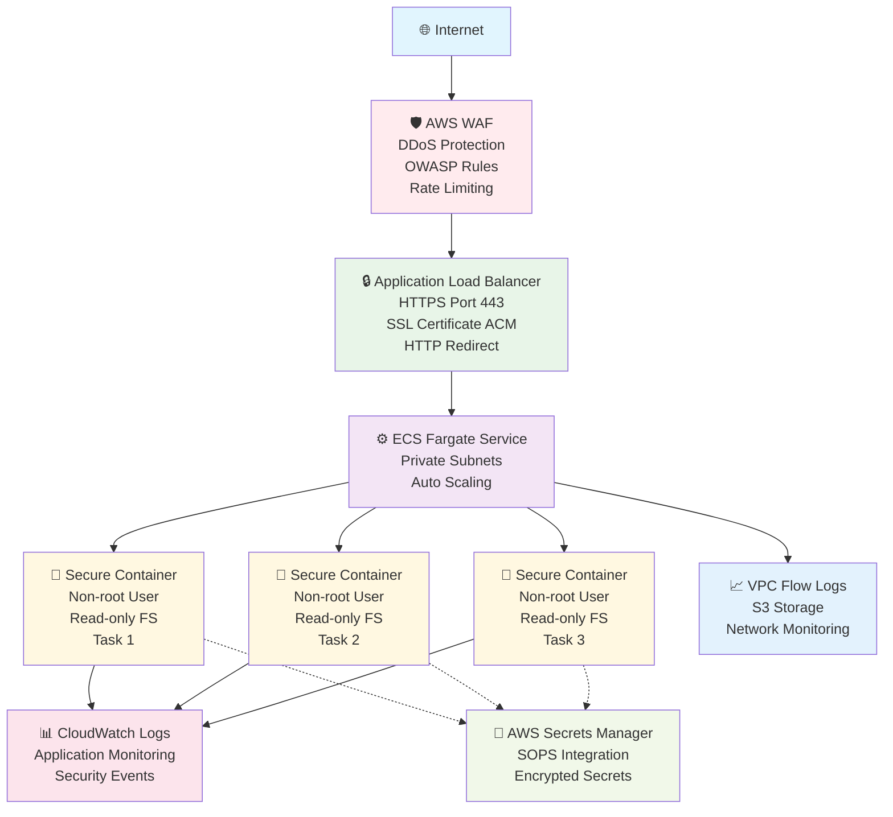

# TestApp Infrastructure

Enterprise-grade AWS CDK TypeScript infrastructure for Django TestApp deployment to ECS Fargate with comprehensive security enhancements.

## 🚀 Features

### Core Infrastructure
- **Environment-specific configuration** with toggles for IPv6 and HA NAT Gateways
- **IPv6 Support**: Configurable IPv6 support for modern networking
- **High Availability NAT Gateways**: Production-ready HA NAT Gateway setup
- **ECS Fargate**: Serverless container management
- **Application Load Balancer**: Layer 7 load balancing with health checks
- **Auto Scaling**: CPU and memory-based scaling policies
- **CloudWatch Integration**: Comprehensive logging and monitoring
- **ECR Repository**: Private container registry with lifecycle policies
- **SOPS Secrets Integration**: Encrypted secrets management with AWS Secrets Manager

### 🔒 Security Enhancements (Toggle-Based)
- **AWS WAF Protection**: DDoS protection, OWASP Top 10 mitigation, rate limiting
- **VPC Flow Logs**: Network traffic monitoring with S3 storage and lifecycle policies
- **HTTPS/TLS Support**: ACM SSL certificates with DNS validation and HTTP redirect
- **Container Security**: Non-root user, read-only filesystem, resource constraints
- **Least Privilege IAM**: Minimal required permissions for all components

## Environment Configuration

| Environment | IPv6 | HA NAT Gateways | AZs | Desired Count | CPU | Memory | Security Features |
|-------------|------|----------------|-----|---------------|-----|--------|------------------|
| dev         | ❌   | ❌             | 2   | 1             | 256 | 512    | Basic (all disabled by default) |
| production  | ✅   | ✅             | 3   | 3             | 1024| 2048   | Enhanced (toggleable) |

> **Note**: All security enhancements are **disabled by default** and can be enabled individually using Makefile commands.

## 🛠 Quick Start

### Using Makefile (Recommended)
```bash
# Install infrastructure dependencies
make infra-install

# Build TypeScript
make infra-build

# Run tests
make infra-test

# Deploy to development
make infra-deploy-dev

# Deploy to production
make infra-deploy-prod

# Check security configuration status
make infra-security-status
```

### Direct CDK Commands
```bash
# Install dependencies
npm install

# Build TypeScript
npm run build

# Deploy to development (default)
npx cdk deploy TestApp-dev

# Deploy to production
npx cdk deploy TestApp-production

# View differences
npx cdk diff TestApp-production

# Synthesize CloudFormation templates
npx cdk synth
```

## 🔒 Security Enhancement Commands

All security features are **disabled by default** for cost optimization. Enable as needed:

```bash
# Enable AWS WAF protection
make infra-enable-waf

# Enable VPC Flow Logs monitoring
make infra-enable-flow-logs

# Enable HTTPS/TLS with certificate
make infra-enable-https

# Enable container security (non-root, read-only filesystem)
make infra-enable-container-security

# Check current security status
make infra-security-status

# Disable all security features (reset to defaults)
make infra-disable-security
```

## 🏗 Architecture

### Basic Architecture (Security Features Disabled)



### Enhanced Architecture (Security Features Enabled)



## 📊 Stack Outputs

### Core Outputs
- **VpcId**: VPC identifier for network integration
- **ClusterName**: ECS cluster name for service management
- **RepositoryUri**: ECR repository URI for container images
- **LoadBalancerDNS**: Application Load Balancer DNS name
- **ServiceName**: ECS service name for monitoring
- **ApplicationUrl**: Direct URL to access the application (HTTP/HTTPS)

### Security Outputs (When Enabled)
- **WAFWebACLArn**: WAF Web ACL ARN for monitoring and configuration
- **FlowLogsBucketName**: S3 bucket name for VPC flow logs analysis
- **CertificateArn**: SSL certificate ARN for domain validation

## 🔐 Security Features

### Core Security (Always Enabled)
- **Network Isolation**: Applications run in private subnets
- **Least Privilege IAM**: Minimal required permissions for all tasks
- **Security Groups**: Restricted network access with explicit rules
- **Container Scanning**: ECR image vulnerability scanning on push
- **CloudWatch Monitoring**: Comprehensive logging and metrics
- **SOPS Secrets Integration**: Encrypted secrets with KMS and fallback

### Enhanced Security (Toggle-Based)
- **AWS WAF Protection**: Web application firewall with managed rules
- **VPC Flow Logs**: Network traffic monitoring and analysis
- **HTTPS/TLS**: End-to-end encryption with managed certificates
- **Container Security**: Non-root execution and filesystem isolation

## 💰 Cost Optimization

### Resource Optimization
- **Environment-specific sizing**: Different resource allocations per environment
- **NAT Gateway optimization**: Single NAT in dev (cost), HA in production (reliability)
- **Auto Scaling**: Automatic capacity adjustment based on demand
- **ECR lifecycle policies**: Automatic cleanup of old container images

### Security Cost Management
- **Toggle-based security**: Enable expensive features only when needed
- **Flow logs retention**: Configurable retention periods (30/90 days)
- **WAF rule optimization**: Environment-specific rate limits and geo-blocking

## 📈 Monitoring & Observability

### Application Monitoring
- **Health Checks**: Application-level health monitoring via `/health/` endpoint
- **Auto Scaling Metrics**: CPU and memory utilization tracking
- **CloudWatch Logs**: Centralized application logging with structured formats
- **Container Insights**: ECS-specific performance metrics

### Security Monitoring (When Enabled)
- **WAF Metrics**: Attack patterns, blocked requests, rate limit violations
- **VPC Flow Logs**: Network traffic patterns, suspicious connections
- **Certificate Monitoring**: SSL certificate expiration and validation status

## 🧪 Testing

Comprehensive test coverage with Jest:

```bash
# Run all infrastructure tests
make infra-test

# Run security-specific tests
npm test -- --testNamePattern="WAF|Flow|Container|security"
```

**Test Coverage**:
- ✅ Basic infrastructure components (17 tests)
- ✅ Security feature toggles (8 tests)
- ✅ Environment-specific configurations
- ✅ Resource property validation
- ✅ Output generation verification

## 📋 Prerequisites

### Required Tools
- **AWS CLI** configured with appropriate permissions
- **AWS CDK** v2.x installed globally
- **Node.js** 18+ and npm
- **SOPS** for secrets management (optional, fallback available)

### AWS Permissions
The deploying user/role needs permissions for:
- **Core Services**: VPC, ECS, ECR, ALB, CloudWatch, IAM, Secrets Manager
- **Security Services** (when enabled): WAF, Certificate Manager, S3
- **CDK Bootstrap**: CloudFormation, S3 (CDK assets)

## 🤝 Contributing

1. Fork the repository
2. Create a feature branch
3. Add/update tests for new features
4. Run `make infra-test` to ensure tests pass
5. Submit a pull request

## 📝 License

This infrastructure code is part of the TestApp assessment project.