# TestApp Infrastructure

Enterprise-grade AWS CDK TypeScript infrastructure for Django TestApp deployment to ECS Fargate with modular architecture and comprehensive security enhancements.

## 🚀 Features

### 🏗️ **Modular Stack Architecture**
- **VPC Stack**: Isolated networking with IPv6 support and VPC Flow Logs
- **ECS Platform Stack**: Container platform with ALB, WAF, and HTTPS
- **Application Stack**: Fargate services with auto-scaling and secrets management
- **Integration Stack**: End-to-end orchestration and cross-stack dependencies

### Core Infrastructure
- **Environment-specific configuration** with toggles for IPv6 and HA NAT Gateways
- **IPv6 Support**: Dual-stack networking with configurable CIDR blocks
- **High Availability NAT Gateways**: Production-ready HA NAT Gateway setup
- **ECS Fargate**: Serverless container management with auto-scaling
- **Application Load Balancer**: Layer 7 load balancing with health checks and HTTPS
- **Auto Scaling**: CPU, memory, and request-based scaling policies
- **CloudWatch Integration**: Comprehensive logging and monitoring with structured logs
- **ECR Repository**: Private container registry with lifecycle policies and vulnerability scanning
- **SOPS Secrets Integration**: Encrypted secrets management with KMS and fallback

### 🔒 Security Enhancements
- **AWS WAF Protection**: DDoS protection, OWASP Top 10 mitigation, rate limiting, geo-blocking
- **VPC Flow Logs**: Network traffic monitoring with S3 storage and lifecycle policies
- **HTTPS/TLS Support**: ACM SSL certificates with DNS validation and HTTP-to-HTTPS redirect
- **Container Security**: Non-root user, read-only filesystem, resource constraints, tmpfs volumes
- **Least Privilege IAM**: Minimal required permissions with inline policies
- **Route53 DNS**: A and AAAA record management with ALB integration

## Environment Configuration

| Environment | IPv6 | HA NAT Gateways | AZs | Desired Count | CPU | Memory | Security Features |
|-------------|------|----------------|-----|---------------|-----|--------|------------------|
| dev         | ❌   | ❌             | 2   | 1             | 256 | 512    | Basic (all disabled by default) |
| production  | ✅   | ✅             | 3   | 3             | 1024| 2048   | Enhanced (toggleable) |

> **Note**: All security enhancements are **disabled by default** and can be enabled individually using Makefile commands.

## 🛠 Quick Start

### Using Makefile (Recommended)
```bash
# Install infrastructure dependencies
make infra-install

# Build TypeScript
make infra-build

# Run tests
make infra-test

# Deploy to development
make infra-deploy-dev

# Deploy to production
make infra-deploy-prod

# Check security configuration status
make infra-security-status
```

### Direct CDK Commands
```bash
# Install dependencies
npm install

# Build TypeScript
npm run build

# Deploy to development (creates full infrastructure)
npx cdk deploy TestApp-VPC-dev TestApp-Platform-dev TestApp-App-dev --context environment=dev

# Deploy to production (creates full infrastructure)  
npx cdk deploy TestApp-VPC-production TestApp-Platform-production TestApp-App-production --context environment=production

# Deploy PR environment (ephemeral - reuses existing dev infrastructure)
npx cdk deploy TestApp-App-dev-pr-123 --context environment=dev --context prId=123

# View differences
npx cdk diff --context environment=production

# Synthesize CloudFormation templates
npx cdk synth
```

## 🔒 Security Configuration

**HTTPS/TLS is enabled by default** for all environments using ACM certificates:

- **Certificate**: `assessment.elio.eti.br` with wildcard `*.assessment.elio.eti.br`
- **Development**: `https://dev-testapp.assessment.elio.eti.br`
- **Production**: `https://testapp.assessment.elio.eti.br` 
- **PR Deployments**: `https://pr-{id}-testapp.assessment.elio.eti.br`

**Environment-Specific Security Features:**

**Development Environment:**
- HTTPS/TLS: ✅ Enabled
- WAF Protection: ❌ Disabled (cost optimization)
- VPC Flow Logs: ❌ Disabled (cost optimization) 
- Container Security: ❌ Disabled (development flexibility)

**Production Environment:**
- HTTPS/TLS: ✅ Enabled
- WAF Protection: ✅ Enabled
- VPC Flow Logs: ✅ Enabled
- Container Security: ✅ Enabled (non-root, read-only filesystem)

**PR Deployments (Ephemeral):**
- **Infrastructure**: Reuses existing dev VPC and ECS cluster  
- **Resources**: Only creates new ECS service/task
- **Security**: Inherits from base development environment
- **Cost**: Minimal additional resources (1-2 containers)
- **Cleanup**: Delete stack when PR is merged

**Deployment Examples:**
```bash
# Deploy regular development environment
npx cdk deploy --context environment=dev

# Deploy ephemeral PR environment  
npx cdk deploy --context environment=dev --context prId=456

# Check security status
make infra-security-status
```

# Disable all security features (reset to defaults)
make infra-disable-security
```

## 🏗 Architecture

### Basic Architecture (Security Features Disabled)

```mermaid
graph TD
    Internet[🌐 Internet] 
    ALB[🔗 Application Load Balancer<br/>HTTP Port 80<br/>Public Subnets]
    ECS[⚙️ ECS Fargate Service<br/>Private Subnets]
    Container1[📦 Container<br/>Task 1]
    Container2[📦 Container<br/>Task 2] 
    Container3[📦 Container<br/>Task 3]
    CloudWatch[📊 CloudWatch Logs<br/>Application Monitoring]
    
    Internet --> ALB
    ALB --> ECS
    ECS --> Container1
    ECS --> Container2
    ECS --> Container3
    Container1 --> CloudWatch
    Container2 --> CloudWatch
    Container3 --> CloudWatch
    
    style Internet fill:#e1f5fe
    style ALB fill:#f3e5f5
    style ECS fill:#e8f5e8
    style Container1 fill:#fff3e0
    style Container2 fill:#fff3e0
    style Container3 fill:#fff3e0
    style CloudWatch fill:#fce4ec
```



### Enhanced Architecture (Security Features Enabled)

```mermaid
graph TD
    Internet[🌐 Internet]
    WAF[🛡️ AWS WAF<br/>DDoS Protection<br/>OWASP Rules<br/>Rate Limiting]
    ALB[🔒 Application Load Balancer<br/>HTTPS Port 443<br/>SSL Certificate ACM<br/>HTTP Redirect]
    ECS[⚙️ ECS Fargate Service<br/>Private Subnets<br/>Auto Scaling]
    SecureContainer1[🔐 Secure Container<br/>Non-root User<br/>Read-only FS<br/>Task 1]
    SecureContainer2[🔐 Secure Container<br/>Non-root User<br/>Read-only FS<br/>Task 2]
    SecureContainer3[🔐 Secure Container<br/>Non-root User<br/>Read-only FS<br/>Task 3]
    VPCFlowLogs[📈 VPC Flow Logs<br/>S3 Storage<br/>Network Monitoring]
    CloudWatch[📊 CloudWatch Logs<br/>Application Monitoring<br/>Security Events]
    SecretsManager[🔐 AWS Secrets Manager<br/>SOPS Integration<br/>Encrypted Secrets]
    
    Internet --> WAF
    WAF --> ALB
    ALB --> ECS
    ECS --> SecureContainer1
    ECS --> SecureContainer2
    ECS --> SecureContainer3
    SecureContainer1 --> CloudWatch
    SecureContainer2 --> CloudWatch
    SecureContainer3 --> CloudWatch
    ECS --> VPCFlowLogs
    SecureContainer1 -.-> SecretsManager
    SecureContainer2 -.-> SecretsManager
    SecureContainer3 -.-> SecretsManager
    
    style Internet fill:#e1f5fe
    style WAF fill:#ffebee
    style ALB fill:#e8f5e8
    style ECS fill:#f3e5f5
    style SecureContainer1 fill:#fff8e1
    style SecureContainer2 fill:#fff8e1
    style SecureContainer3 fill:#fff8e1
    style VPCFlowLogs fill:#e3f2fd
    style CloudWatch fill:#fce4ec
    style SecretsManager fill:#f1f8e9
```



## 📊 Stack Outputs

### Core Outputs
- **VpcId**: VPC identifier for network integration
- **ClusterName**: ECS cluster name for service management
- **RepositoryUri**: ECR repository URI for container images
- **LoadBalancerDNS**: Application Load Balancer DNS name
- **ServiceName**: ECS service name for monitoring
- **ApplicationUrl**: Direct URL to access the application (HTTP/HTTPS)

### Security Outputs (When Enabled)
- **WAFWebACLArn**: WAF Web ACL ARN for monitoring and configuration
- **FlowLogsBucketName**: S3 bucket name for VPC flow logs analysis
- **CertificateArn**: SSL certificate ARN for domain validation

## 🔐 Security Features

### Core Security (Always Enabled)
- **Network Isolation**: Applications run in private subnets
- **Least Privilege IAM**: Minimal required permissions for all tasks
- **Security Groups**: Restricted network access with explicit rules
- **Container Scanning**: ECR image vulnerability scanning on push
- **CloudWatch Monitoring**: Comprehensive logging and metrics
- **SOPS Secrets Integration**: Encrypted secrets with KMS and fallback

### Enhanced Security (Toggle-Based)
- **AWS WAF Protection**: Web application firewall with managed rules
- **VPC Flow Logs**: Network traffic monitoring and analysis
- **HTTPS/TLS**: End-to-end encryption with managed certificates
- **Container Security**: Non-root execution and filesystem isolation

## 💰 Cost Optimization

### Resource Optimization
- **Environment-specific sizing**: Different resource allocations per environment
- **NAT Gateway optimization**: Single NAT in dev (cost), HA in production (reliability)
- **Auto Scaling**: Automatic capacity adjustment based on demand
- **ECR lifecycle policies**: Automatic cleanup of old container images

### Security Cost Management
- **Toggle-based security**: Enable expensive features only when needed
- **Flow logs retention**: Configurable retention periods (30/90 days)
- **WAF rule optimization**: Environment-specific rate limits and geo-blocking

## 📈 Monitoring & Observability

### Application Monitoring
- **Health Checks**: Application-level health monitoring via `/health/` endpoint
- **Auto Scaling Metrics**: CPU and memory utilization tracking
- **CloudWatch Logs**: Centralized application logging with structured formats
- **Container Insights**: ECS-specific performance metrics

### Security Monitoring (When Enabled)
- **WAF Metrics**: Attack patterns, blocked requests, rate limit violations
- **VPC Flow Logs**: Network traffic patterns, suspicious connections
- **Certificate Monitoring**: SSL certificate expiration and validation status

## 🧪 Testing

Comprehensive test coverage with Jest - **100% SUCCESS RATE**:

```bash
# Run all infrastructure tests
make infra-test

# Run specific test suites
npm test -- test/vpc-stack.test.ts
npm test -- test/ecs-platform-stack.test.ts
npm test -- test/application-stack.test.ts
npm test -- test/testapp-infrastructure.test.ts

# Run security-specific tests
npm test -- --testNamePattern="WAF|Flow|Container|security"
```

**Test Results** (✅ 146 PASSED, ❌ 0 FAILED, ⏭ 11 SKIPPED):

### 🏗 **VPC Stack Tests** - 26/26 PASSING (7 skipped)
- ✅ VPC configuration with custom CIDR blocks
- ✅ Public/private subnet creation across multiple AZs
- ✅ IPv6 support with dual-stack networking
- ✅ NAT Gateway and Internet Gateway configuration
- ✅ VPC Flow Logs with S3 storage and lifecycle policies
- ✅ Security group creation and IPv6 ingress rules
- ✅ Environment-specific removal policies
- ✅ Stack outputs and resource tagging

### 🎯 **ECS Platform Stack Tests** - 45/45 PASSING (1 skipped)
- ✅ ECS cluster creation with container insights
- ✅ ECR repository with lifecycle policies and scanning
- ✅ Application Load Balancer with HTTPS support
- ✅ SSL certificate management and DNS validation
- ✅ Route53 record creation (A and AAAA)
- ✅ WAF configuration with managed rule sets
- ✅ Rate limiting and geographic restrictions
- ✅ CloudWatch log group creation
- ✅ Production-grade security features

### ⚙️ **Application Stack Tests** - 49/49 PASSING (3 skipped)
- ✅ ECS task definition and Fargate service
- ✅ Auto scaling policies (CPU and memory based)
- ✅ Target group configuration with health checks
- ✅ IAM roles with least privilege access
- ✅ Secrets Manager integration with SOPS
- ✅ Container security features
- ✅ Environment-specific deployment configurations
- ✅ Resource tagging and compliance

### 🔄 **Integration Tests** - 22/22 PASSING
- ✅ End-to-end stack integration
- ✅ Multi-environment deployment validation
- ✅ Security feature toggles and combinations
- ✅ Edge cases and error handling
- ✅ Cross-stack resource dependencies

## 📋 Prerequisites

### Required Tools
- **AWS CLI** configured with appropriate permissions
- **AWS CDK** v2.x installed globally
- **Node.js** 18+ and npm
- **SOPS** for secrets management (optional, fallback available)

### AWS Permissions
The deploying user/role needs permissions for:
- **Core Services**: VPC, ECS, ECR, ALB, CloudWatch, IAM, Secrets Manager
- **Security Services** (when enabled): WAF, Certificate Manager, S3
- **CDK Bootstrap**: CloudFormation, S3 (CDK assets)

## 🤝 Contributing

1. Fork the repository
2. Create a feature branch
3. Add/update tests for new features
4. Run `make infra-test` to ensure tests pass
5. Submit a pull request

## 📝 License

This infrastructure code is part of the TestApp assessment project.